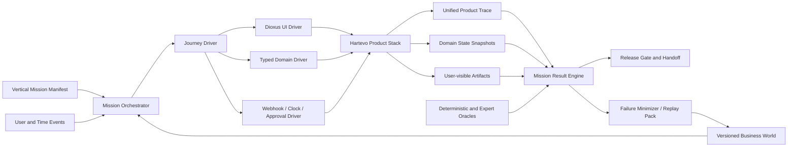

# Hartevo 垂直 Mission Harness 工程路线

> **在 Hartevo Desktop 仓库中的状态：质量工程目标合同。** 任何完成声明必须由本仓库对应版本的 Mission Eval 与可重放证据重新证明。

状态：**Target Contract**；不表示当前仓库已经实现全部组件
Desktop 采用版本：2026-08-11-v5
目标：让每次代码、模型、Prompt、Skill、Capability 或 Provider 变化都能回答“它是否更好地完成了 Hartevo 用户的增长业务目标”

## 1. Harness 的主体是业务世界，不是 Prompt

Hartevo Harness 必须能够运行一个有持续状态的业务世界：品牌有产品、市场、网站、历史内容、Partner、客户、订单和约束；时间会推进；用户会纠正目标；Provider 会失败；外部动作需要审批；结果会通过 Webhook 或测量返回。

Harness 的最小有意义输出不是“模型回答符合预期”，而是：

```text
Mission 目标
→ 初始项目世界
→ 用户和系统事件
→ Agent/Worker/Browser 执行轨迹
→ Work Product 与领域状态变化
→ Effect/Receipt/Verification
→ Outcome/Attribution
→ 下一轮决策
→ 业务 Oracle 判定
```

单元测试、工具 Contract、SSE 顺序和安全测试仍是基础，但必须能归属到 Mission Checkpoint。

### 1.1 PenguinHarness 的采用边界

PenguinHarness 为本路线提供 Harness Candidate Lab 的工程参考：极简工具 schema、冻结 Benchmark、私有 Rubric、append-only Trace、版本快照、Evaluator/Optimizer 隔离和失败驱动候选优化。具体采用与修正见 [PenguinHarness Rust 能力引入清单](../research/PENGUIN-HARNESS-RUST-CAPABILITY-INTAKE.md)。

Hartevo 不采用“模型写最终 Score”“单 Run Baseline 对比多 Run Candidate”或“Optimizer 直接改写生产 Agent”的合同。Harness 的主体仍是版本化业务世界，最终指标由 Rust Result Engine、确定性/可复算 Oracle 和受限专家 Judge 共同产生。

### 1.2 Prime Agent 的采用边界

Prime Agent 为本路线提供 Context Fabric 的工程参考：外置 Working Set、Context Branch、retained worker、daemon detach / reattach、append-only Session Tree、自动压缩和 Continual Harness。具体采用与修正见 [Prime Agent Rust Context Fabric 引入清单](../research/PRIME-AGENT-RUST-CONTEXT-FABRIC-INTAKE.md)。

Hartevo 不运行 Prime Agent daemon、IPython 或 executable Python skill，也不把 Session、kernel namespace 或 LLM summary 当作业务事实。其 Continual Harness 只能生成 Candidate，并进入 Penguin-inspired frozen Benchmark、Evaluator 隔离、Promotion 和 rollback；不能直接改写生产 Harness、权限、Oracle 或 Gate。

## 2. Desktop 初始工程缺口

Desktop 工程实现尚未开始，首个可发布版本必须补齐以下能力，不能继承其他代码库的完成度判断：

| 领域 | 必须建立的 Harness 能力 |
| --- | --- |
| Product UI | 跨工作面 Journey Driver、可读 Work Product 验收、用户纠正和跨日连续性 |
| Domain/API | 版本化业务 Fixture Loader、领域快照、业务不变量 Oracle |
| Capability | Capability→Mission 覆盖账本、Provider 行为模拟、业务结果合同 |
| Agent Runtime | 目标理解、动态 DAG、Replan、Context Capsule、Worker Graph、压缩不变量、长周期连续性和 Work Product 质量 Eval |
| Worker/Effect | 事件级故障注入、确定性时钟、跨队列 Journey 和结果回流 |
| Browser | 可重放页面世界、Profile 所有权 Fixture、登录/验证码/崩溃脚本 |
| CRM/Inbox/Partner | 关系生命周期、Consent、Supply Class、消息/订单/Commission 世界 |
| Eval | Mission Manifest、World Fixture、Journey Runner、业务 Oracle、差异报告 |

## 3. 目标架构



### 3.1 Benchmark Stack：通用基准是地基，不是产品终点

Hartevo 使用同一套可追溯 Runner 连接公开通用 Benchmark 与自有垂直 Mission，但两者回答不同问题：

| 层 | 数据可见性 | 回答的问题 | 能否单独放行产品 |
| --- | --- | --- | --- |
| G0 Runtime Contract | 公开 | Tool schema、sandbox、patch、terminal、stream、resume 是否正确 | 否 |
| G1 Public Generic | 公开 | Hartevo Runtime/Harness 在主流 Agent 工作负载中是否有基本竞争力 | 否，只用于生态比较与通用回归 |
| V0 Vertical Development | 开发者、Target 与 Optimizer 可见 | 怎样改善 Hartevo 的十二类 Mission 和已知失败 | 否，属于样本内优化 |
| V1 Private Holdout | 只对隔离 Evaluator 可见 | Candidate 是否泛化到未见行业、市场、表达和失败组合 | 是，Candidate 必经 Gate |
| V2 Fresh Rolling Shadow | 冻结后新编写，Target/Optimizer 不可见 | 数据分布变化、Benchmark 污染和长期过拟合是否已经发生 | 是，发布与季度能力声明必经 Gate |
| V3 Controlled Provider / Production Replay | 最小授权范围 | 本地无法复制的真实 Provider、账号和网络边界 | 只能补充，不能替代 V1/V2 |

首批 G1 Registry：

| Benchmark | Hartevo 用途 | 采用边界 |
| --- | --- | --- |
| Terminal-Bench 2.1 | terminal、长命令、环境配置、重试、循环检测、进程生命周期与任务恢复 | 固定 task/repository/container 版本；公开题可用于诊断，不能作为唯一晋升集 |
| SWE-bench family | patch、测试、代码仓库理解和修改闭环；用于站点、Connector、Recipe 与 Rust 工程能力 | 每个变体单独 pin；Verified 只保留兼容趋势，优先引入可复现的更新/Live split；不把公开榜单分数当成垂直业务能力 |

后续引入 OS、浏览器、研究、Office 或 MCP 类公开基准时，必须先进入 `GenericBenchmarkRegistry`，记录来源、许可证、版本、环境 digest、公开/隐藏状态、污染风险、已知坏题、评分器和 Harness adapter。公开数据集的题目、答案或 verifier 不得被复制进 V1/V2 后再声称为私有样本外测试。

Terminal-Bench 2.1 本身说明了为什么必须版本化：它修正了 2.0 中 89 题里的 28 题，问题包含外部依赖漂移、资源不匹配和任务/测试错配。Benchmark 分数是 `model + harness + provider route + environment + budget + dataset revision + scorer` 的联合结果，不是模型或 Harness 的单一属性。

### 3.2 Cline / Kimi K3 案例应怎样解读

Cline 公开文章报告了同一 Terminal-Bench 2.1 上的以下过程：stock Cline + Kimi K3 经 OpenRouter 为 `69/89 = 77.5%`；合并 Candidate 为 `77/89 = 86.5%`；确认 Run 为 `79/89 = 88.8%`。改动包括限流重试、output-aware loop detection、异步存活修复和避免 `pkill` 自杀，且文章说明没有修改 verifier、按 task name 分流或膨胀 timeout。这证明 Benchmark 驱动可以发现真实的 Harness 可靠性问题。

但这篇公开报告没有给出独立样本外测试；诊断、修改和确认仍围绕 TB2.1。Moonshot 同时报告 Kimi K3 + Kimi Code 在 TB2.1 为 `88.3%`。两者 Provider route、Harness、成本、运行配置与实验过程并不完全一致，不能用 `88.8 vs 88.3` 证明 Cline 普遍优于 Kimi Code。更谨慎的结论是：优化后的 Cline 把 Kimi K3 从明显低于其专用 Harness 的位置提升到同一成绩区间，而是否能迁移到新任务分布仍需 OOS 证明。

Hartevo 因此禁止以下宣传捷径：

- 只报告 Candidate 在被反复查看的公开 Benchmark 上的最高分；
- 把不同 Provider、模型参数、Harness、预算、重试和环境的分数直接相减；
- 用“通用修复看起来合理”替代新任务分布验证；
- 把一次 confirmation run 称为稳定泛化；
- 把模型专用 Harness 追平后的成绩全部归因于自我改进系统。

### 3.3 模型、Harness 与泛化增益拆解

每次比较定义完整配置：

```text
Score = S(model, provider_route, harness, effort, budget,
          benchmark_revision, environment_digest, scorer, repetitions)
```

同一 Candidate 至少报告：

| 指标 | 定义 |
| --- | --- |
| `DevGain` | 同模型、Provider、预算和环境下，Candidate 与 Baseline 在 V0 的配对差 |
| `HoldoutGain` | Candidate 与 Baseline 在 V1 的配对差；Target/Optimizer 从未读取样本或失败 Trace |
| `FreshGain` | Candidate 与 Baseline 在冻结后新编写 V2 的配对差 |
| `CrossModelTransfer` | 至少两个模型家族上是否保持非负，并明确 model-specific 例外 |
| `GenericTransfer` | G1 中 terminal/patch/recovery 等通用能力是否改善且无主流回归 |
| `VerticalMissionGain` | MGCR、VBOR、LCR、Work Product 接受率与零容忍不变量的变化 |
| `EfficiencyGain` | 每个完成 Mission 的 Token、成本、时长、重试和人工分钟变化 |

模型原生/专用 Harness（例如 Kimi K3 + Kimi Code）是外部参考线，不自动成为 Hartevo Formal Baseline。Formal Baseline 必须与 Candidate 使用相同模型、Provider route、effort、预算、环境和运行次数；否则只显示并排结果，不计算 `HarnessGain`。

若 Candidate 只对一个模型有效，允许以 `model-specific Harness Profile` 晋升，但不能宣称为通用 Harness 改进。若 V0 提升而 V1/V2 无提升，结论是 `BENCHMARK_OVERFIT`；若样本量不足或置信区间无法区分，结论是 `INCONCLUSIVE`，不能用最高单次分数替代。

### 3.4 Hartevo Vertical Benchmark 的构造方式

Hartevo 借鉴公开 Agent Benchmark 的工程结构，不复制其考试答案：固定环境、机器可读任务、受控工具、有限预算、最终 Artifact、确定性 Verifier、完整 Trace 和可复现实验。垂直层在此基础上增加业务世界、身份/权限、时间、用户修正、Provider 事件、外部 Effect 和 Outcome。

每个垂直 Case 至少包含：

```text
Case Manifest
├─ Mission goal / KPI / stop condition
├─ Project and business-world snapshot
├─ user, clock, provider and fault event script
├─ allowed capabilities / data / effect scope
├─ token, cost, time, retry and concurrency budget
├─ expected work products and state transitions
├─ private deterministic/recomputable oracle
├─ contamination canary and provenance
└─ failure taxonomy / replay contract
```

十二条 Mission 的公开开发集可以放在仓库中；V1 private holdout 的 Prompt、World delta、Rubric、Oracle 和 gold artifact 不进入产品仓库、Target Context、Optimizer Trace 或普通 CI log。V2 每季度由领域专家和生产 Replay 重新补充，冻结后才允许运行 Candidate。

在对外声称 Harness 或模型能力提升前，每个 P0 Mission Family 目标至少覆盖 `20` 个 V0 组合、`10` 个 V1 组合和 `5` 个冻结后 V2 组合；不足时可以继续工程开发，但报告必须标记 `INSUFFICIENT_OOS_EVIDENCE`。

### 3.5 Candidate 晋升合同

Candidate 必须在完全配对的 Run Matrix 中与 Baseline 比较：相同模型、Provider route、effort、环境、预算、并发、重试策略和重复次数。晋升同时满足：

1. V0 改善可解释到 Trace、状态或可靠性机制，而不是只看总分；
2. V1 没有 P0 Mission、零容忍、安全、Effect 或事实回归，并出现可重复的净改善；
3. V2 不出现 `BENCHMARK_OVERFIT`，新行业、市场、语言和表达保持稳定；
4. 至少两个模型家族非负，否则只晋升为明确的 model-specific profile；
5. G1 没有 terminal、patch、recovery、cost 或 latency 的未批准重大退化；
6. 使用 paired bootstrap / McNemar 等适用统计方法报告区间；样本不足时保持 `INCONCLUSIVE`；
7. 单位 Mission 成本、耗时、重试和人工审核符合 Release Gate；
8. Evaluator、Optimizer 与 Target 身份、Context、网络和存储隔离，且访问审计为零泄漏。

## 4. 建议目录

```text
evals/
  benchmarks/
    generic/               # pinned public benchmark adapters; not product gates
    vertical-dev/          # V0 repository-visible Hartevo cases
    manifests/             # V1/V2 metadata only; private content stored separately
  missions/
    vm-00-current-state.yaml
    vm-01-seo-operator.yaml
    vm-02-ai-visibility-operator.yaml
    vm-03-site-foundation.yaml
    vm-04-social-matrix.yaml
    vm-05-email-acquisition.yaml
    vm-06-partner-affiliate.yaml
    vm-07-new-market-decision.yaml
    vm-08-marketplace-operator.yaml
    vm-09-b2b-pipeline.yaml
    vm-10-inbox-handoff.yaml
    vm-11-mission-outcome.yaml
  worlds/
    projects/
    truth/
    crm/
    conversations/
    partners/
    commerce/
    websites/
  providers/
    search/
    ai-ground-truth/
    marketplace/
    channels/
    partner-networks/
    stripe/
    email/
  artifacts/
    documents/
    images/
    feeds/
    expected/
  oracles/
    deterministic/
    recomputable/
    rubrics/
  variants/
  baselines/
  benchmark-registry/
  reports/
tools/eval/
  mission-runner/
  world-loader/
  provider-simulator/
  trace-collector/
  report-generator/
```

目录名是目标合同；创建前应与仓库现有测试脚本和构建方式对齐。

## 5. Business World Fixture

### 5.1 世界状态

每个 Fixture 是可版本化、可重置、可复算的业务世界，至少包含：

- Tenant、User、Membership、Session 和 Project；
- Brand、Product、Audience、Market、Conversion Route；
- 网站页面、Sitemap、Schema、CTA 和历史版本；
- Buyer Question、Evidence、Ground Truth 和 Provider 估算；
- Campaign、Content、Publication 和 Measurement；
- Partner Identity、Supply Class、Program、Relationship、Link/Coupon，以及 Creator Task/Bounty、Acceptance、Deliverable revision/digest、Review、Dispute；
- Person、Company、Opportunity、Consent、Task、Note；
- Inbox、Contact、Conversation、Message、Assignment、Handoff；
- Click、Lead、Order、Refund、Commission、Payout 和 Attribution；
- Run、Task、Approval、Effect、Receipt、Verification、Cost 和 Event；
- 时间、预算、权限、连接器状态和故障计划。

### 5.2 来源与可信度

Fixture 事实需要模拟真实 Hartevo Truth Graph：

```yaml
factId: fact_product_compatibility_01
subject: product:mxzone-filter-a
predicate: compatible_with
value: shark-nv360
source:
  type: tenant_document
  artifact: product-manual.pdf
  locator: page:12
observedAt: 2026-06-01T00:00:00Z
validFrom: 2026-06-01T00:00:00Z
confidence: 1.0
status: confirmed
supersedes: null
```

冲突 Fixture 同时包含营销页面声称、产品手册、用户确认和过期 CRM 记录，使系统必须做证据分级，而不是只测试读取成功。

### 5.3 可复算商业事件

订单、退款、佣金和归因不能是自由文本。Fixture 必须提供可独立计算的期望结果：

```yaml
order:
  id: order-1001
  amountMinor: 12999
  currency: EUR
  occurredAt: 2026-07-10T10:00:00Z
touches: [citation-01, publication-02, partner-click-03]
refunds:
  - amountMinor: 3000
    occurredAt: 2026-07-20T10:00:00Z
program:
  attributionWindowDays: 30
  commissionBps: 1200
expected:
  netRevenueMinor: 9999
  commissionMinor: 1200
```

## 6. Mission Manifest 与 Checkpoint

Manifest 以 `HARTEVO-EVAL-SCENARIO-CATALOG.md` 的业务 Mission 为准。Runner 需要支持：

- 初始世界和用户 Persona；
- 业务目标、硬约束和允许的 Effect；
- 多轮用户输入、附件、审批、人工接管和系统事件；
- 虚拟时间推进到小时、天、周或退款窗口；
- Checkpoint 的前置条件、用户可见状态和完成标准；
- 必须/允许/禁止 Capability 类别；
- Work Product、领域状态和 Outcome Oracle；
- 成本、时限、人工交互和 Provider 调用预算；
- 故障、恢复和替代路径。

Runner 还必须理解 `operatingContract`：

- `mode`：一次决策、一次建设、Campaign、持续经营或持续关系；
- `cadence`：即时、每日、每周、每月或事件触发；
- `autonomy`：自动读取、自动出 Draft、预批准动作和逐次审批边界；
- `targetMetrics`：该 Mission 自己的成功指标；
- `stopConditions`：用户暂停、预算耗尽、连接失效、目标达成或活动到期；
- `completionPolicy`：正常结束还是进入下一周期。

Harness 必须断言 Hartevo 只执行实现当前目标所需的能力子图。SEO Mission 不应因为系统拥有 Partner/CRM 能力就自动打开它们；一次市场决策也不应被强制变成长期 Campaign。

Checkpoint 示例：

```yaml
id: vm02.evidence-ready
after: [vm02.context-confirmed]
expect:
  userVisibleStage: Building the German market evidence baseline
  workProducts: [market-evidence-pack, buyer-question-map]
  domainState:
    audiences: {min: 1, market: DE}
    evidence: {min: 8, provenanceCoverage: 1.0}
  capabilities:
    requiredAny: [research.discover, visibility.scan]
    forbidden: [publication.publish, partner.engage, domain.purchase]
  decision:
    separates: [confirmed_fact, provider_estimate, agent_inference, unknown]
```

## 7. Journey Driver

### 7.1 三种入口同一业务状态

Journey Driver 必须能组合：

1. **Dioxus UI Driver**：模拟用户从登录、项目选择、总调度、任务、渠道、CRM、达人、连接与设置操作；
2. **Domain/API Driver**：适用于 Webhook、Partner Signup、Credential Claim 和确定性系统事件；
3. **Time/Operator Driver**：推进时间、批准/拒绝、人工接管、重启组件、恢复连接器。

同一 Mission 可以从总调度开始、在任务或业务工作面查看 Work Product、在 CRM 审批跟进、由 Webhook 接收回复，再回到总调度复盘。Harness 不应把每个工作面当成独立产品。

### 7.2 用户行为不是固定 Prompt

Driver 必须支持：

- 用户中途改变市场、受众、预算、时限和禁用渠道；
- 指代已有 Work Product 或“第二个方案”；
- 上传文件、纠正事实、要求遗忘；
- 离线后返回、跨设备/Session 继续；
- 只批准部分内容或部分 Partner；
- 对建议提出反问、拒绝或要求依据；
- 等待数天后接收搜索、AI、CRM、订单和退款事件。

## 8. Provider Simulator

Simulator 不只返回 HTTP 状态码，而要模拟业务语义。

| Provider World | 必须支持的行为 |
| --- | --- |
| Search/DataForSEO | 有结果、空结果、估算、市场/语言差异、429、异步任务、过期结果 |
| AI Ground Truth | 问题/模型/回答/引用、登录状态、页面变化、人工接管、结果不稳定 |
| Marketplace/Sorftime | 商品、销量估算、评论、Listing、不同市场和币种、字段缺失 |
| Site/GitHub | 页面版本、PR、测试、Merge/Deploy、Provider Success 但 URL 不可用 |
| Channel/Browser | API 发布、网页登录、验证码、Session 过期、重复提交、可见性验证 |
| Partner Network | 认证权限、官方库存、关系状态、申请、Link、Transaction、Webhook；Hartevo Opt-in Creator 的 Task/Bounty、接受、交付、Review 与 Payout eligibility |
| CRM/Email | Consent、发送、Bounce、Reply、Unsubscribe、乱序线程和人工接管 |
| Stripe | Checkout、Portal、成功/取消、重复 Webhook、退款和 Credits |
| Commerce/Attribution | Click、Lead、Order、Refund、Commission、Payout、重复和乱序 |

每个 Effect Provider 必须能模拟“外部已经执行，但客户端超时且 Receipt 未持久化”，以验证 `uncertain` 和独立核查。

## 9. Product Trace

### 9.1 用户目标级事件

在现有事件信封基础上，Harness 需要能观察或推导：

```text
mission.started
goal.confirmed / changed
project.context.loaded
fact.candidate_found / confirmed / conflicted / invalidated
evidence.collection_started / ready
decision.proposed / accepted / rejected
plan.created / revised
work_product.created / revised / accepted
approval.requested / decided
effect.proposed / executed / uncertain / verified
relationship.changed
message.received / sent / handed_off
creator.hiring_published / application_received / awarded
creator.task_funded / accepted / deliverable_uploaded / reviewed
creator.payout_verified / entitlement_granted / disputed
outcome.observed
attribution.calculated / disputed
next_loop.proposed / accepted
mission.partial / completed / failed
```

这些事件是可审计的产品摘要，不是 Chain-of-Thought。

### 9.2 必备关联字段

- `missionId`、`scenarioVersion`、`worldVersion`、`checkpointId`；
- `tenantIdHash`、`projectId`、`conversationId`、`runId`、`taskId`；
- `workProductId`、`approvalId`、`effectId`、`receiptId`、`verificationId`；
- `personId`、`companyId`、`partnerId`、`campaignId`、`publicationId`、`orderId` 的用途隔离引用；
- `capability`、`effectClass`、`provider`、`model`、`skillDigest`、`schemaDigest`；
- `sequence`、单调时间偏移、Queue/Execution/Persist/Render 时长；
- Input/Output Digest，不复制 Secret、Prompt 原文或 PII；
- Token、Provider Cost、Browser Time 和外部金额；
- `failureClass`、`responsibility`、`recoveryAction`。

### 9.3 用户可见步骤 Oracle

Trace Collector 同时检查：

- 第一条具体过程是否在相关正文之前；
- 相同 Step ID 是否原位更新；
- 是否长期重复“Working with project evidence”；
- 等输入、等审批、排队、人工接管和 Provider 故障是否说明下一步；
- 终态后是否仍出现正文或正在执行事件；
- OpenInterpreter、MCP、私有 Tool Name、Thread/Harness ID、Migration ID、Secret 是否泄漏给用户。

## 10. Oracle Stack

### 10.1 确定性 Oracle

- Tenant、Project、User、Profile 和 Credential Ownership；
- Schema、状态机、版本、乐观锁和删除围栏；
- Approval、Idempotency、Effect、Receipt、Verification 和 Audit；
- Supply Class、Consent、人工接管和消息方向；
- 金额、币种、订单、退款、Commission、Payout；
- Creator Task 合同版本、Deliverable digest/安全/使用权、User Review、Dispute 与接受前禁付；
- Webhook 验签、重复、乱序和 Provider→Project 路由；
- URL/PR/Publication 是否真实存在；
- Conversation/Run 连续性和事件顺序；
- Context Capsule 的 Project/Mission 隔离、child authority 子集、Worker lease/generation 和预算归因；
- Compaction 前后的 Goal、Constraint、用户纠正、Evidence lineage、Pending Effect、Stop Condition 与 Work Product version；
- Context Branch merge 不产生重复 Effect、静默事实覆盖或产物版本倒退；
- 禁止 Capability、预算和用户硬约束。

### 10.2 可复算 Oracle

- 关键词/排名/趋势公式和时间窗；
- Evidence 覆盖、冲突和去重；
- Partner/CRM 实体解析与评分；
- DAG 合法性、依赖、关键路径和 Replan 差异；
- Attribution、漏斗、Revenue、Refund 和 Commission；
- 成本、延迟、队列、公平性和容量。

### 10.3 专家与 Judge

仅用于：

- 市场决策是否合理；
- Buyer Question 和内容是否对真实用户有价值；
- Evidence Pack 是否足以支持决策；
- Partner/Opportunity 排序理由是否可信；
- Work Product 是否可被业务用户采用；
- 下一轮 Continue/Stop/Scale/Test 建议是否适当。

Judge 必须与至少 200 个双人专家样本校准；确定性 Oracle 冲突时以确定性 Oracle 为准。被测 Agent 不能评价自己的成功。

## 11. Capability Coverage Harness

版本声明支持的每个 Capability 都必须通过三层证据：

1. **Contract**：输入、输出、Effect Class、权限、成本、超时和失败；
2. **Mission Use**：在正确业务 Checkpoint 被选择，并产生有增量价值的状态/产物；
3. **Outcome Link**：若声称影响业务结果，能够连接到 Verification、Outcome 或 Attribution。

Harness 生成如下账本：

```json
{
  "capability": "ground_truth.measure",
  "contract": "PASS",
  "missions": ["VM-02", "VM-11"],
  "providerModes": ["simulator", "controlled-browser"],
  "businessOutputs": ["ground-truth-run", "recommendation-evidence"],
  "lastEvidenceLevel": "E3",
  "gaps": ["real-provider sample below E4 threshold"]
}
```

Agent Runtime 暴露的工具是受控入口；它们应映射到 Canonical Capability 和领域命令。Harness 不以“模型叫对了某个私有工具名”为用户价值，而以领域结果判断。

## 12. Failure Minimizer 与 Replay Pack

每个失败自动产出：

- 最小 World State；
- 最少用户轮次和系统事件；
- Provider/Fault 脚本；
- 关键 Trace；
- 领域状态 Before/After；
- 用户可见截图/Artifact；
- 失败 Oracle、责任边界和复现命令；
- 关联 Issue/Commit 和修复后的永久回归 ID。

最小化不得删掉导致错误的业务上下文。例如 Partner 自动触达错误若依赖 Supply Class，就不能压缩成没有 Partner Identity 的通用 Tool Test；Creator 付款错误若依赖 Task revision、Deliverable digest 或 User Review，也不能最小化掉这些合同事实。

长上下文失败的 Replay Pack 还必须包含压缩前 source range、`CompactionRecord`、Continuation Ledger revision、Context Capsule、Worker Graph、lease/generation、模型/Provider/Runtime 配置和回流消息。只有摘要文本而没有 typed invariant diff 的失败不能关闭。

## 13. 本地执行层级

| 层级 | 内容 | 目的 |
| --- | --- | --- |
| L0 | Manifest/World/Schema 校验、确定性 Oracle、静态安全 | 测试资产本身可信 |
| L1 | Domain/Capability/Planner/Memory/Effect 组件测试 | 局部合同正确 |
| L2 | Domain/SQLite/Worker/OpenInterpreter/Browser Simulator 集成 | Checkpoint 状态和故障恢复 |
| L3 | Dioxus 跨工作面 Mission Journey | 用户可以完成目标、审阅产物和恢复 |
| L4 | 本地 Release Candidate：P0 Mission、并发、Soak、差异报告 | 发布前完整证据 |
| Controlled Provider | 真实模型、搜索、浏览器、渠道、Partner、Stripe 的低量对照 | 只验证本地不能复制的边界 |
| Production | 健康、网络、配置和最小 Canary | 不承担普通逻辑调试 |

执行顺序固定为先本地、再受控 Provider、最后最小生产 Canary；具体命令以仓库脚本为准。

## 14. 分阶段实施

### H0：Mission Foundation

交付：

- Mission/World/Checkpoint/Result JSON Schema；
- HarnessProfile、BenchmarkRevision、RunMatrix、CandidateBundle 与 PromotionDecision Schema；
- GenericBenchmarkRegistry、DatasetPartition、ContaminationRecord 与 OOS Report Schema；
- Terminal-Bench 2.1 与一个 pin 后的 SWE-bench family adapter；
- `blank-brand-v1`、`conflicted-truth-v1`、`mxzone-de-market-v1`；
- World Loader、虚拟 Clock、Domain Snapshot、Trace Collector；
- VM-00 当前状态识别和 Operating Contract；
- VM-01 SEO Operator 的最小 Baseline→Work Queue→Review Journey；
- 统一 JSON/Markdown 报告。

退出条件：同一 Commit 连跑三次状态和 Digest 一致；失败可一键重放。

### H1：Core Growth Operators

交付：

- VM-01 SEO、VM-02 AI Visibility、VM-03 Site、VM-04 Social；
- Search、GSC/Analytics、GT、Channel、Site/GitHub Simulator；
- Truth/Evidence/Decision/Work Product Oracle；
- Dioxus 总调度↔业务工作面跨入口 Journey；
- 用户中途改 KPI、频率、自主级别、预算和渠道的 Replan。

退出条件：系统能交付可审阅的业务决策和产物，不把通用回答算成功。

### H2：Acquisition and Relationship Operators

交付：

- VM-05 Email、VM-06 Partner/Affiliate/Creator Work、VM-09 B2B Pipeline、VM-10 Inbox；
- Partner/CRM/Email/Commerce/Stripe Simulator；
- Approval、Uncertain、Receipt、Verification、Consent、Handoff、Funding Reservation、真实 Deliverable、Review、Rights Entitlement、Refund 和 Payout Oracle；
- Playwright 跨路由 Journey 和人工接管测试。

退出条件：所有 External Effect 安全不变量通过，关系和经济状态可复算。

### H3：Decision、Marketplace 与 Mission Outcomes

交付：

- VM-07 新市场决策、VM-08 Marketplace、VM-11 各经营目标 Outcome；
- 跨周虚拟时间和事件驱动；
- 各 Mission KPI→Attribution→正常结束或下一周期；
- Skill Draft Eval 与权限检查；
- Harness Candidate Lab：固定 Run matrix、隔离 Optimizer/Evaluator/Target、Candidate Snapshot、晋升与回滚；
- 多模态 Artifact Intake；
- 分池调度、并发、8 小时 Soak、成本曲线；
- Production Bug 自动压缩为 Replay Pack。

退出条件：本地可以证明 Hartevo 既能正确完成一次性决策，也能按用户选择持续经营 SEO、AI、社媒、邮件和 Partner，而不是把所有用户塞进同一个大循环。

## 15. 一键命令目标合同

建议最终提供稳定入口，名称可按仓库规范调整：

```text
eval validate-assets
eval run --mission VM-01 --world mxzone-seo-established-v1 --mode local
eval run --suite p0 --mode local-rc
eval run --benchmark terminal-bench-2.1 --profile <profile>
eval run --partition vertical-holdout --candidate <candidate-id>
eval replay --failure <failure-id>
eval compare --baseline <release> --candidate <commit>
eval optimize-harness --profile <profile> --benchmark <revision> --rounds <n>
eval promote-harness --candidate <candidate-id> --canary
eval report --run <eval-run-id>
```

命令必须失败关闭：工作区/Commit 不匹配、World 不可重置、样本不足、必需 Gate 缺失、零容忍失败时不能输出 `passed=true`。

## 16. 报告产物

- `mission-summary.json`：十二条 Mission 的状态、成熟度和失败 Checkpoint；
- `mission-results.jsonl`：每次变体的输入摘要、世界版本、结果和 Trace；
- `capability-ledger.json`：Capability→Mission→Provider→证据等级；
- `business-state-diff.json`：领域状态 Before/After；
- `metrics.json`：MGCR、VBOR、LCR、时序、成本、资源和返工；
- `artifacts/`：用户可见 Work Product、页面截图和 Verification；
- `regressions.md`：相对基线的业务改善和退化；
- `candidate-promotion-decision.json`：候选质量、安全、成本、延迟、稳定性与晋升/回滚结论；
- `benchmark-matrix.json`：model/provider/harness/budget/environment/dataset/scorer 的完整配对结果；
- `oos-generalization.json`：DevGain、HoldoutGain、FreshGain、CrossModelTransfer 与污染审计；
- `release-handoff.md`：可直接用于发布决策的摘要。

## 17. 回归门禁

- 任一零容忍失败：立即阻断；
- P0 Mission 从 PASS 变 FAIL/NOT_IMPLEMENTED：阻断；
- MGCR、VBOR 或 LCR 下降超过 2 个百分点：阻断并人工复核；
- 高影响事实/金额/Consent/Attribution 错误：阻断；
- 新版本产生更多 Narrative-only Completion 或 False Complete：阻断；
- Work Product 接受率下降超过 5 个百分点：阻断；
- p95 或单位 Mission 成本回退超过门槛且无批准解释：阻断；
- 仅 Judge 分数变化、确定性状态不变：抽样专家复核，不自动修改 Oracle。
- Candidate 的分数由模型写入、Baseline/Candidate Run matrix 不一致或样本不足：结果为 `INCONCLUSIVE`，禁止晋升。
- Candidate 只在 V0/公开 Benchmark 提升而 V1/V2 不提升：结果为 `BENCHMARK_OVERFIT`，禁止通用晋升。
- V1/V2 Prompt、Rubric、Oracle、gold artifact 或失败 Trace 被 Target/Optimizer 读取：该 Benchmark revision 作废并轮换。

## 18. 禁止的 Harness 反模式

- 以 `hello`、标准命令句或一次 Tool Call 代表产品质量；
- 按 INT/TOL/MEM/PERF 分类堆数量，却没有完整业务 Mission；
- 只检查 Agent 是否调用工具，不检查领域状态和用户产物；
- 只测 GEO 分数，不测 SEO→GDO、Conversion、Partner、CRM 和 Attribution；
- 把 Draft、Plan、Provider Success 或 CRM Stage 记为业务结果；
- 用固定九角色或固定步骤替代动态目标规划；
- 用 LLM Judge 判定金额、租户、Consent、Effect 和 Attribution；
- 让 Target 或 Optimizer 读取私有 Rubric、holdout Case，或修改 Fixture、Oracle、Gate；
- 用单 Run Baseline 对比多 Run Candidate，或因 Judge 均值略高就声称自我进化成功；
- 在同一公开题集上反复 hill climb 后，把 confirmation run 当成样本外泛化；
- 直接比较不同 Provider route、effort、预算、重试、环境或 scorer 的总分并归因于 Harness；
- 只公布 best-of-N，不公布失败 Run、无效 Run、重复次数、成本和置信区间；
- 让模型自报 Goal complete 代替 Work Product、Receipt、Verification 和 Outcome；
- 为通过测试静默改 Fixture 或 Oracle；
- 生产首次发现会话、流式、审批、发布和恢复错误；
- 用单次成功截图覆盖长期 Mission、失败路径和下一轮。

## 19. 路线图完成定义

Mission Harness 达到产品级必须满足：

1. 十二条垂直 Mission 均有可执行合同；声明为当前支持的 Mission 可在本地版本化业务世界中运行；
2. 总调度、任务、业务工作面、Worker、Browser 和 Provider 能组成同一个 Journey；
3. 结果由 Work Product、领域状态、Receipt、Verification、Outcome 和 Attribution 共同判断；
4. Capability 的价值能回到具体 Mission，不再以工具数量计完成；
5. 任何生产问题都能变成可本地重放的业务 Fixture；
6. 生产部署只验证真实环境边界，不再承担第一次产品功能发现。
7. Harness/Prompt/Skill/Route 的任何自动优化都经过冻结 Benchmark、隔离 Candidate、可复算 Gate、Canary 和可回滚晋升。
8. 通用公开 Benchmark、垂直开发集、私有 Holdout 和滚动新鲜集均有独立版本、访问边界、污染记录与配对报告。

## 20. 公开基准与案例依据

- [Terminal-Bench 2.1 发布说明](https://www.tbench.ai/news/terminal-bench-2-1)
- [Cline：Recursive Self Improvement for Coding Agents](https://cline.bot/blog/recursive-self-improvement-for-coding-agents)
- [Kimi K3 官方评测与 Harness 说明（固定提交）](https://github.com/MoonshotAI/Kimi-K3/tree/3cb39dfd32e51c3328e2e4b4af21341247d06c43)
- [SWE-bench Verified 与 Bash-only 对照](https://www.swebench.com/verified.html)
- [OpenAI：SWE-bench Verified 的污染与评分问题](https://openai.com/index/why-we-no-longer-evaluate-swe-bench-verified/)
